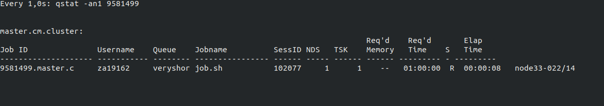

```{r setup, include=FALSE}
knitr::opts_chunk$set(echo = TRUE)
```

# VPN when Logging in From Outside the Uni Network
To log in, we need to `ssh` in. When we are in the university network, this is enough. However, when we are outside of it, we also need to use a VPN. To use the VPN simply visit the website [https://uobnet2.bristol.ac.uk/vdesk/webtop.eui?webtop=/Common/uobnet&webtop_type=webtop_full](VPN Bristol) and wait for it to connect. 


# Logging In
Now open a terminal and type 

```{bash, eval=FALSE}
ssh za19162@bluecrystalp3.acrc.bris.ac.uk
```

where `za19162` should be your university username. If you have not previously saved the password, you will be prompted to type it in, otherwise we're ready to start.

# Uploading Data to the cluster
To upload data we use the `scp`, which stands for "secure copy". In order to use this comand we need to specify from where the data moves (out computer) to where (the cluster). For this reason, we type `pwd` in the command line connected to the cluster. It will output something like this: `/newhome/za19162`. 

### Uploading a Folder
Most times you will be uploading a folder. For instance, suppose we want to upload a folder called `myfolder`, containing a text file called `mytextfile.txt`. The first thing we need to do is to find out what's the path of that folder in our machine. In this case it's 
`/home/mauro/Documents/University/StatisticalComputing2/IntroHPC/myfolder`. Suppose now we want to upload this folder into some other folder in the cluster called `myclusterfolder`, created using `mkdir myclusterfolder`. Then we would use the following command in a terminal _on out machine_ to upload, where `-r` flags that we are uplaoding a folder.

```{bash, eval=FALSE}
scp -r /home/mauro/Documents/University/StatisticalComputing2/IntroHPC/myfolder za19162@bluecrystalp3.acrc.bris.ac.uk:/newhome/za19162/myclusterfolder
```

You should be shown something similar to this


### Uploading a File
The same procedure as for the folder, just without the flag `-r`.

# Downloading Data from the Cluster
This will be useful once we have obtained some results. We use the same command `scp` but we just invert the source and the destination directory. For instance, to copy back the folder into our `IntroHPC` directory, with name `myfolder2` we would do the following

```{bash, eval=FALSE}
scp -r za19162@bluecrystalp3.acrc.bris.ac.uk:/newhome/za19162/myclusterfolder/myfolder /home/mauro/Documents/University/StatisticalComputing2/IntroHPC/myfolder2
```

With output


Indeed we can see the new folder has been created.


# Job Scheduling
Suppose that our goal is to run an R script that at different stages of the algorithm needs to log a matrix. In our simple case we have matrices `m1` and `m2` and we want to write them one after the other in the same file. It could look like this:

```{r, eval=FALSE}
m1 = matrix(1:9, 3, 3)
m2 = matrix(10:18, 3, 3)
write(c(m1), file="matrix_file.txt", ncol = 9)
write(c(m2), file="matrix_file.txt", ncols = 9, append=TRUE)
```

This script is written in the file `writing_matrices.R` contained in the `writing_matrices` folder. We can run this script using a job script. This is an `.sh` file that looks as follows:

```{bash, eval=FALSE}
#!/bin/bash
#
#
#PBS -l nodes=1:ppn=1,walltime=1:00:00

# Define working directory
export WORK_DIR=$HOME/writing_matrices

# Define executable
export EXE="/usr/bin/env Rscript writing_matrices.R"

# Add R module
module add languages/R-3.0.2

# Change into working directory
cd $WORK_DIR

# Do some stuff
echo JOB ID: $PBS_JOBID
echo Working Directory: `pwd`
echo Start Time: `date`

# Execute code
$EXE

echo End Time: `date`

sleep 20
```

Let's break it down:

- `#PBS -l nodes=1:ppn=1,walltime=1:00:00` is telling the scheduling system to assign 1 node of the cluster and of that one node, only 1 processor (`ppn` stands for processor per node). `walltime` is denoting how much time we are expecting the job to take. Notice that if the job will take more than this, it will be stopped automatically. 

- `export WORK_DIR=$HOME/writing_matrices` is creating a variable containing the path to the folder that we will upload, containing the script.
- `export EXE="/usr/bin/env Rscript writing_matrices.R"` set a variable containing the command that we want to execute. In this case, we want to run the R script `writing_matrices.R`. To run an `R` script we need to use the command `Rscript` whose code is found in `/usr/bin/env`.
- The remaining of the script `cd`'s into the desired directory, so that our results will be stored there. Then it prints out the JOB ID, the workign directory, the start time. Finally, the command is executed and we print the end time.

After having uploaded it to the cluster using 

```{bash, eval=FALSE}
scp -r /home/mauro/Documents/University/StatisticalComputing2/IntroHPC/writing_matrices za19162@bluecrystalp3.acrc.bris.ac.uk:/newhome/za19162/writing_matrices
```

We can use the command line connected to the cluster to `cd` into the `writing_matrices` folder and run

```{bash, eval=FALSE}
qsub job.sh
```

We should see a job ID printed out, such as

```{bash, eval=FALSE}
9581499.master.cm.cluster
```

One nice commmand to see how the job is progressing at an interval specified by the user is the `watch` command applied to the `qstat` command. The flag `-an1` also shows the nodes used. Together the command would look as follows

```{bash, eval=FALSE}
watch --interval=1 qstat -an1 9581499
```

where `--interval=1` specifies that we want to update the output of the command `qstat -an1 9581499` every second. `qstat` shows the execution details of the job (whether it is in the queue, how long the queu is, etc) and `9581499` is the job ID.

The output should look like this:


We notice that since we gave 1 hour of wall time this job has been put into the `veryshort` queue. Once the job is finished the status flag, now showing `Q` for queu, will turn to `E` and finally to `C`, meaning the job has been cancelled. Once the job starts running, we should see something like this:



If we now go back to our folder we should see some output.


First of all, there are two files with similar names: `job.sh.e9581499` and `job.sh.o9581499`. The first reports the "standard error" output, i.e. eventual errors are shown here. We can check it by typing `cat job.sh.e9581499`, and we should see something like this:

```{txt, eval=FALSE}
Error in write(c(m2), file = "matrix_file.txt", ncols = 9, append = TRUE) : 
  unused argument (ncols = 9)
Execution halted
```

This is telling us that there was a mistake in our `write` function. Indeed the function takes `ncol` as argument, rather than `ncols`. 
Luckily, the first time we wrote the function we use the correct argument so some output was created. We can `cat` the `job.sh.o9581499` file and see

```{bash, eval=FALSE}
JOB ID: 9581499.master.cm.cluster
Working Directory: /newhome/za19162/writing_matrices
Start Time: Fri May 29 11:11:43 BST 2020
End Time: Fri May 29 11:11:43 BST 2020
```

the job ID, working directory, start time and end time of the job. Next, we inspet the `matrix_file.txt` and we can indeed see that the matric has been written there.


# Running A parallel OpenMP Job
Suppose we have the simple script 

```{Rcpp, eval=FALSE}
#include <iostream>
#include <random>
#include <cmath>

#ifdef _OPENMP
  #include <omp.h>
#else
  #define omp_get_thread_num() 0
#endif

int main(int argc, char **argv){
  // Run a simple loop and print stuff
  #pragma omp parallel for
  for (int i=0; i < 10; i++){
    std::cout << "Thread: " << omp_get_thread_num() << "Loop Iteration: " << i << std::endl;
  }
}
```

in the file `simplecpp.cpp`. Then to run the job in parallel we need to modify the job script to look as follows

```{bash, eval=FALSE}
#!/bin/bash
#
#
#PBS -l nodes=1:ppn=10,walltime=1:00:00

# Define working directory
export WORK_DIR=$HOME/cpp_job

# Define executable
export EXE1="gcc -fopenmp simplecpp.cpp -o simplecpp"
export OMP_NUM_THREADS=10
export EXE3="./simplecpp"

# Add R module
module add languages/gcc-9.1.0

# Change into working directory
cd $WORK_DIR

# Do some stuff
echo JOB ID: $PBS_JOBID
echo Working Directory: `pwd`
echo Start Time: `date`

# Execute code
$EXE1
$EXE2
$EXE3 

echo End Time: `date`


sleep 20
```

Notice how we've set `10` processors to be used and we've also set `OMP_NUM_THREADS=10`, so that each processor uses a thread. In addition, we have first compiled the C++ program by adding the module `languages/gcc-9.1.0` and then using the `gcc` compiler with the openmp flag `-fopenmp`. Then we've executed the file. The output should be similar to this, after the job has been run:

```{bash, eval=FALSE}
JOB ID: 9581785.master.cm.cluster
Working Directory: /newhome/za19162/cpp_job
Start Time: Fri May 29 12:13:37 BST 2020
Thread: Thread: 2Loop Iteration: 25Loop Iteration: 5

Thread: Thread: 3Loop Iteration: 3
Thread: 0Loop Iteration: 0
Thread: 4Loop Iteration: 4
Thread: 9Loop Iteration: 9
6Loop Iteration: 6
Thread: 7Loop Iteration: 7
Thread: 8Loop Iteration: 8
Thread: 1Loop Iteration: 1
End Time: Fri May 29 12:13:39 BST 2020
```

