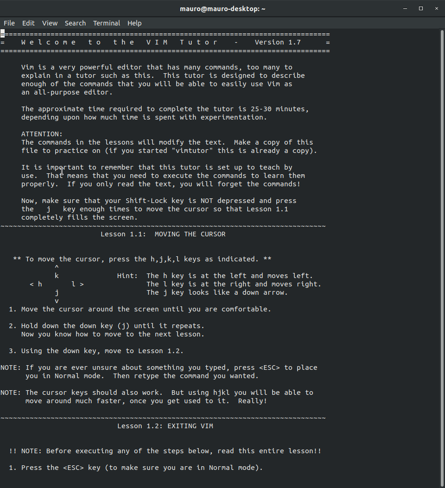

```{r setup, include=FALSE}
knitr::opts_chunk$set(echo = TRUE)
```

# Downloading the Data Set
We will work with the classic Iris data set. First we need to download it. We do this with the `wget` command.

```{bash}
wget -O iris.csv "https://raw.githubusercontent.com/jbrownlee/Datasets/master/iris.csv"
```

Here the flag `-O` is a shorthand for `--output-document` and it is used to specify the file name onto which the data will be downloaded. We can see that the data has been downloaded by running a simple `ls` command.
```{bash}
ls
```

The content of the of the file can be displayed in several ways. For instance, we can use `head` and specify a number of initial rows to display using the `-n` flag.
```{bash}
head -n 5 iris.csv
```

A better option, is to show a table rather than the raw data. We can do this using the `column` command specifying that this is a comma-separated file with the `-s","` option and by specifying tab formatting `-t`.
```{bash}
head -n 5 iris.csv | column -s"," -t 
```

Finally, we can leverage Python to print an even prettier representation of the data. To do this, we install `csvkit`

```{bash, eval=FALSE, message=FALSE}
pip3 install csvkit
```

And then we run the following command.
```{bash}
head -n 5 iris.csv | csvlook
```

One can use the `cut` command to extract different columns. This is done by specifying a comma delimiter `-d ","` and then which column we want to analyze via the `-f` flag. 
```{bash}
cat iris.csv | head -n 10 | cut -d ',' -f 1
```
```{bash}
cat iris.csv | head -n 10 | cut -d ',' -f 5
```

# Exploratory Data Analysis
Let's learn more about this dataset. First of all, we can find out the number of examples it contains.
```{bash}
cat iris.csv | wc -l
```

Next, we want to see how many different classes of irises are availabe. To do this, we just pipe the command used to extract the label column and feed it into the `uniq` keyword. This keyword also takes the flag `-c` which will specify how many occurrences of each unique label are present.
```{bash}
cat iris.csv | cut -d ',' -f 5 | uniq -c
```

As we've seen in the tutorials, we can use text regular expressions to search through the data. One of the most useful commands here is `grep`. For instance, if we want to find all `versicolor`-labelled data points we run this.

```{bash}
cat iris.csv | grep -i "versicolor" | head -n 5
```

Notice that we've used the `-i` flag to not account for differences in lower or upper case.

We can now use a bash script to compute the mean, for each flower type, of `sepal_length`, `sepal_width`, `petal_length` and `petal_width` respectively.
```{bash}
bash compute_means.sh
```

# VimTutor
### Welcome Page
To learn vim we will be using VimTutor which comes shipped in the command line. Just type `vimtutor` and you will be prompted with the following screen.



### Navigation
Immadiately we see that we can use the following commands in vim mode to **navigate**

- `j`: down arrow.
- `k`: top arrow.
- `h`: left arrow.
- `l`: right arrow.

### Exiting Vim

 - Press `ESC` to go to Normal mode.
 - Type the command below and then Enter.
    - `:q!` to discard changes. (`q` for quit)
    - `:wq` to *w*rite and *q*uit.

### Editing Text

- **Delete**: Press `x` to delete the character under the cursor. (press `dd` to delete the whole line)
- **Insert**: Press `i` to go to insert mode. Notice that insertion happens _on the left_ of the cursor. This means that we want to place the cursor _after_ where we want to insert text.
- **Append**: Press `A` to append text. This literally means that if you place the cursor on a given line of text, pressing A will bring you into insert mode, at the end of the line.


### Fancy Deletion Commands

- Deleting a **word**: Place cursor on the first letter of the word you want to delete and press `dw` for delete word.
- Delete to **end of line**: `d$` to delete everything on the right of the cursor, until the end of the line.


### Operators and Motions
Often we use `operator motion` where, for instance

- `d` is the delete operator
- `w` (word + trailing space), `e` (word), `0` (start of the line) and `$` (to end of line) are motions.

Pressing motions without operators will move the cursor!
If we type a number before a motion, it will repeat that motion that number of times, so we can move quicker. 

For instance, to delete `4` words use `d4w`. Placing a number before `dd` will also delete that number of lines.

## Undo Command
To undo the previous command type `u`. Upper case `U` to undo everything done on a line. `CTRL` and `r` revert the undoing.


  


